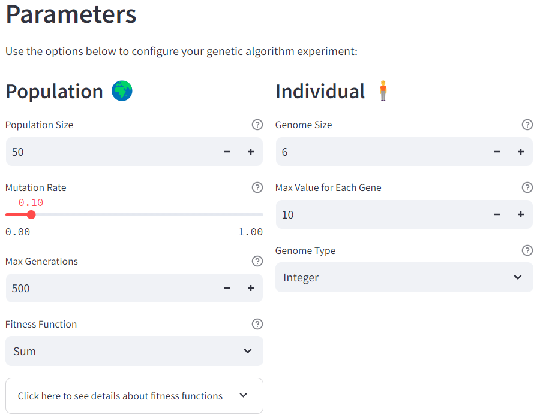
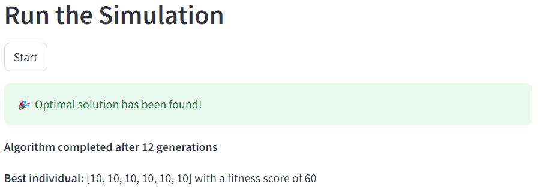

# Genetic Algorithm Playground 🧬

Welcome to the **Genetic Algorithm Playground**! This is an interactive Streamlit web application that lets you experiment with genetic algorithms. It's designed to help you understand how different parameters influence the optimization process and to provide a hands-on experience with one of the most popular evolutionary algorithms.

### 🌐 Try It Out Now!
The app is live and ready for you to explore:  
**[Genetic Algorithm Playground](https://genetic-playground.streamlit.app/)**

## Features
- 🌍 **Customize Population Settings**: Adjust parameters like population size, mutation rate, and the maximum number of generations.
- 👤 **Configure Individuals**: Define genome size, type, and value range to explore different solution spaces.
- ⚙️ **Fitness Functions**: Choose from different fitness evaluation methods to see how they impact algorithm performance.
- 📊 **Real-Time Simulation**: Run the genetic algorithm and visualize the results instantly.

## Getting Started

### Prerequisites
- Python 3.8+
- Streamlit

### Installation
1. Clone this repository:
    ```bash
    git clone https://github.com/lucasbeziers/genetic-algorithm-playground.git
    cd genetic-algorithm-playground
    ```
2. Install dependencies:
    ```bash
    pip install -r requirements.txt
    ```

### Usage
1. Run the Streamlit app:
    ```bash
    streamlit run app.py
    ```
2. Open your browser and navigate to:
    ```
    http://localhost:8501
    ```

3. Experiment with different genetic algorithm parameters and see the results in real-time!

## How It Works
- **Population**: A group of individuals (solutions) is created and evolved over multiple generations.
- **Selection**: The fittest individuals are selected for reproduction.
- **Crossover & Mutation**: Selected individuals produce offspring through crossover, and genes are randomly mutated to introduce diversity.
- **Fitness Evaluation**: Each individual is evaluated based on the chosen fitness function, guiding the evolution towards optimal solutions.

## Available Fitness Functions
- **Sum**: Maximizes the sum of all genes.
- **Even**: Counts the number of even genes.
- **Alternate**: Computes the difference between sums of genes at even and odd indices.

## Example
Here's a quick example of what the app looks like:




## Contributing
Contributions are welcome: feel free to open issues or submit pull requests.

## License
This project is licensed under the MIT License.
